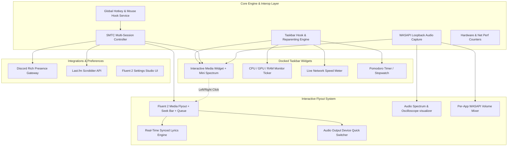
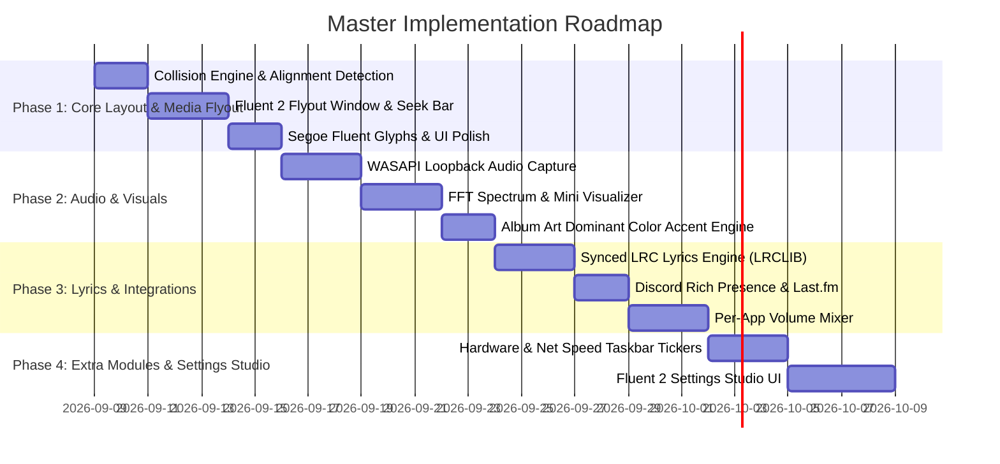

# Taskbar Tool — Next-Gen Master Feature Architecture & Blueprint

## Overview
**Taskbar Tool** is transitioning from a standalone now-playing taskbar widget into a **modular, high-performance Windows 11 Taskbar Desktop Utility Suite**. 

This document outlines the complete architectural vision, technical designs, module breakdowns, and phased rollout for all upcoming features.

---



---

## Complete Feature Matrix

```
┌────────────────────────────────────────────────────────────────────────────────────────┐
│                                   TASKBAR TOOL SUITE                                   │
├───────────────────────┬─────────────────────────┬──────────────────────────────────────┤
│ 1. Core Media Engine  │ 2. Taskbar Modules      │ 3. Audio & Integrations              │
├───────────────────────┼─────────────────────────┼──────────────────────────────────────┤
│ • Full Seek/Scrub Bar │ • CPU/GPU/RAM Monitor   │ • Real-Time Audio Spectrum FFT       │
│ • Synced LRC Lyrics   │ • Live Net Speed Meter  │ • Per-App Audio Volume Mixer         │
│ • Album Art Palette   │ • Pomodoro Timer        │ • Discord RPC & Last.fm Scrobbler    │
│ • Multi-Session Switch│ • Weather & Temp Badge  │ • WASAPI Output Device Switcher      │
│ • Custom Layouts      │ • Quick Notes Scratchpad│ • Global Hotkeys & Mouse Gestures    │
└───────────────────────┴─────────────────────────┴──────────────────────────────────────┘
```

---

## Detailed Feature Modules

### Module 1: Interactive Fluent 2 Media Flyout
When the user clicks or hovers over the taskbar media widget, a Windows 11 Fluent 2 flyout smoothly animates above the taskbar.

1. **Timeline & Seek Bar**:
   - Scrubbable progress slider (`01:24 / 03:45`) driven by SMTC timeline properties (`GlobalSystemMediaTransportControlsSessionTimelineProperties`).
   - Click/drag to seek track position (`TryChangePlaybackPositionAsync`).
2. **Synchronized Lyrics View**:
   - Automatic background fetching from **LRCLIB API** (`https://lrclib.net/api/get`) using track title, artist, and duration.
   - Smooth auto-scrolling karaoke-style synchronized lyrics highlighting the active line.
3. **Repeat & Shuffle Controls**:
   - One-click toggle for Repeat Mode (Off / One / All) and Shuffle Mode.
4. **Audio Output Device Quick Switcher**:
   - Switch active playback output between Headphones, Speakers, and Bluetooth devices directly from the flyout without navigating Windows Settings.
5. **App Whitelist / Blacklist & Session Switcher**:
   - Ignore background noise apps (e.g. system sounds, specific browser tabs, Discord voice) and prioritize dedicated players (Spotify, Apple Music, YouTube Music, Tidal, Foobar2000).

---

### Module 2: Live Audio Visualizer & Spectrum Engine
Integrates low-latency audio capture to render audio-reactive elements.

1. **In-Taskbar Mini Visualizer**:
   - 3 to 6 dancing bars embedded alongside the track title and cover art on the taskbar.
2. **Flyout Expanded Visualizers**:
   - **Frequency Spectrum** (32 to 64 FFT bands with peak decay).
   - **Smooth Waveform / Oscilloscope**.
   - **Radial Audio Ring / Glow** around album art.
3. **Architecture**:
   - WASAPI Loopback capture (`IAudioClient` / NAudio / CSCore loopback recording).
   - Fast Fourier Transform (FFT) processed on a high-frequency background worker, rendered smoothly via WPF `CompositionTarget.Rendering` / Direct2D.

---

### Module 3: Dynamic Visual Themes & Album Art Color Extraction
1. **Adaptive Ambient Glow**:
   - Quantizes the album art bitmap using Octree / Median-Cut color clustering to extract dominant, vibrant, and dark accent colors.
   - Dynamically tints the taskbar widget pill border, background subtle gradient, and progress bar to match the currently playing album art.
2. **Multiple Taskbar Widget Styles**:
   - **Compact Pill**: 24px icon + scrolling title + mini play/pause.
   - **Modern Standard**: Cover art + Title + Artist + Progress line + Next/Previous controls.
   - **Dynamic Ticker**: Wide marquee ticker bar with ambient glow and animated wave.
   - **Minimal Glyph**: Ultra-clean text and play icon only.

---

### Module 4: Extra Taskbar Modules (Modular System)
Users can enable/disable additional modular widgets docked on the taskbar:

1. **Hardware Monitor Ticker**:
   - Live CPU %, GPU %, RAM usage %, and temperature readout.
   - Compact display: `CPU 18%  GPU 42%  RAM 7.4G`.
   - Click opens detailed resource breakdown flyout.
2. **Network Speed Meter**:
   - Real-time download/upload speed indicator (`↓ 8.5 MB/s  ↑ 1.2 MB/s`).
3. **Pomodoro & Productivity Timer**:
   - One-click taskbar Pomodoro timer (`25:00`) with break notifications and audio chimes.

---

### Module 5: Power Controls, Gestures & Global Hotkeys
1. **Mouse Gestures over Taskbar Widget**:
   - **Scroll Wheel**: Increase/decrease active media volume (or system master volume).
   - **Middle Click**: Mute/Unmute active playback.
   - **Left Click**: Open expanded Fluent 2 Flyout.
   - **Double Click**: Bring source media player window to foreground.
   - **Right Click**: Quick context menu (Settings, Session Switcher, Output Device, Exit).
2. **System-Wide Global Hotkeys**:
   - Configurable shortcuts for:
     - `Play/Pause`, `Next Track`, `Previous Track`
     - `Volume Up/Down` for active media app
     - `Toggle Flyout`, `Like Track` (where supported)
     - `Copy Current Track Info` to clipboard

---

### Module 6: Discord Rich Presence & Last.fm Scrobbler
1. **Discord Rich Presence (RPC)**:
   - Connects to local Discord client via IPC socket.
   - Displays real-time rich presence: Album art, song title, artist, live elapsed time counter, and player app icon.
2. **Last.fm Scrobbling**:
   - Built-in Last.fm API 2.0 client (`track.updateNowPlaying` and `track.scrobble` after 50% / 4 minutes).

---

### Module 7: Fluent 2 Settings Studio
A modern Windows 11 WinUI/WPF Settings window with mica/acrylic material backdrop:

```
┌────────────────────────────────────────────────────────────────────────┐
│  ⚙ Taskbar Tool Settings                                     —  □  ✕  │
├───────────────┬────────────────────────────────────────────────────────┤
│ ❖ General     │  Taskbar Widget Placement                              │
│ ♫ Media       │  Position: [ Left Edge | Next to Start | Right Tray ▾] │
│ 🎛 Visualizer │  Left Margin Offset: [ 12 px ▾ ]                       │
│ 🎨 Appearance │                                                        │
│ 📊 Modules    │  Startup & Behavior                                    │
│ 🔗 Integrations│  [✓] Start with Windows                                │
│ ⌨ Hotkeys     │  [✓] Enable Multi-Monitor Taskbars                     │
│ ℹ About       │  [✓] Auto-Hide Taskbar Synchronization                 │
└───────────────┴────────────────────────────────────────────────────────┘
```

---

## Phased Implementation Roadmap



---

## Architectural File Structure

```
src/TaskbarMediaWidget/
├── Audio/
│   ├── WasapiLoopbackCapture.cs         # Low-latency WASAPI loopback capture
│   ├── FftProcessor.cs                  # High performance FFT & peak decay algorithm
│   └── AppVolumeMixer.cs                # Per-application volume control via ISimpleAudioVolume
├── Lyrics/
│   ├── LrcLibClient.cs                  # LRCLIB REST client for synced lyrics
│   └── SyncedLyricsModel.cs             # Timed line parser and synchronization state
├── Integrations/
│   ├── DiscordRpcService.cs             # Discord IPC Rich Presence gateway
│   └── LastFmScrobbler.cs               # Last.fm API 2.0 scrobbling engine
├── Theming/
│   ├── ColorPaletteExtractor.cs         # Octree/Median-Cut album art color quantizer
│   └── FluentThemeManager.cs            # Dynamic brush and gradient manager
├── Modules/
│   ├── HardwareMonitorService.cs        # CPU/GPU/RAM performance counters
│   └── NetworkSpeedMonitor.cs           # Up/Down network interface byte throughput
├── Flyouts/
│   ├── MediaFlyoutWindow.xaml           # Fluent 2 popup flyout
│   ├── MediaFlyoutWindow.xaml.cs        # Seek bar, lyrics viewer, output device picker
│   └── VisualizerCanvas.xaml.cs         # Spectrum & oscilloscope renderer
├── Settings/
│   ├── SettingsModel.cs                 # JSON-backed configuration
│   ├── SettingsWindow.xaml              # Modern WinUI/Fluent 2 settings UI
│   └── SettingsWindow.xaml.cs           # Configuration binding & live hot reload
└── Hotkeys/
    ├── GlobalHotkeyManager.cs           # RegisterHotKey Win32 interop manager
    └── MouseWheelHook.cs                # Taskbar widget wheel hook
```

---

## Verification & Testing Guide

### Build Verification
- Compile with .NET 10: `dotnet build Taskbar-Tool.slnx`
- Verify both `win-x64` and `win-arm64` runtime targets.

### Manual Verification
1. **Media Flyout & Seek**: Scrub playback progress bar, verify accurate seek.
2. **LRC Synced Lyrics**: Verify real-time highlight of singing line.
3. **WASAPI Visualizer**: Verify 60 FPS spectrum bars without latency.
4. **Adaptive Palette Theming**: Verify widget accent colors match active album art.
5. **Taskbar Alignment**: Test on both Left and Center aligned Windows 11 taskbars.
